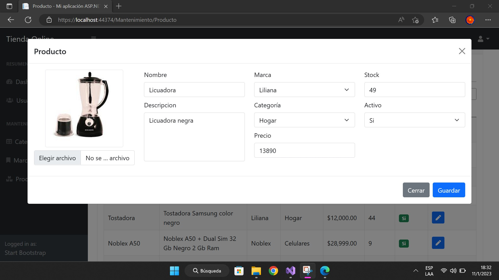

Tienda online con sistema de gestion de productos y usuarios  desarrollada con .net framework MVC + SQL Server 2018.
Los permisos de acceso a las vistas de la aplicación estan dividisos en dos: perfil de administrador y perfil cliente.

Pantalla de Login (vista compartida por admin y cliente)
 
 

 
 
<h3>Vistas Administrador <h3/>
-Gestión de productos
 
 

 
 

 
 
-Gestión de usuarios
 
 
 
 

 

 
 
-Gestión de pedidos (ver, filtrar por fecha y ID transacción, exportar)
 
 

 
 
Vistas Cliente
  
  
Página de inicio 
 
 

  

 
 
-Filtros de búsqueda
 
 

 
 
-Detalle de producto
 
 

 
 
-Carrito
 
 

 

 
 
-Ver mis pedidos
 
 

 
 

  
  
  
  
  
  
  
  
  
  
  
  
  
  
